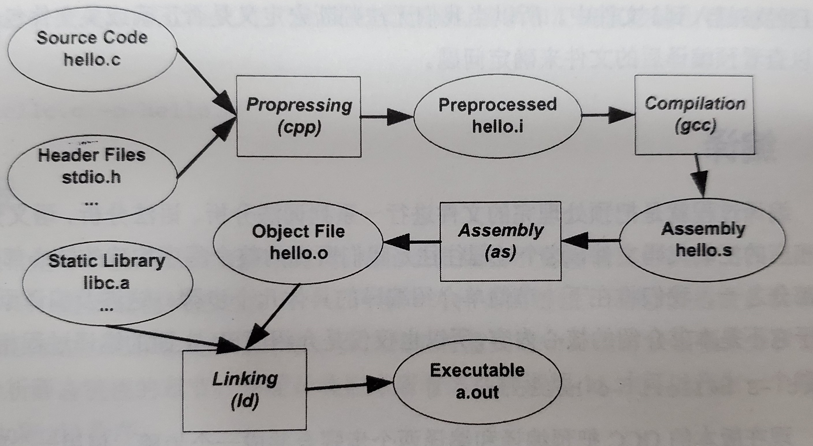
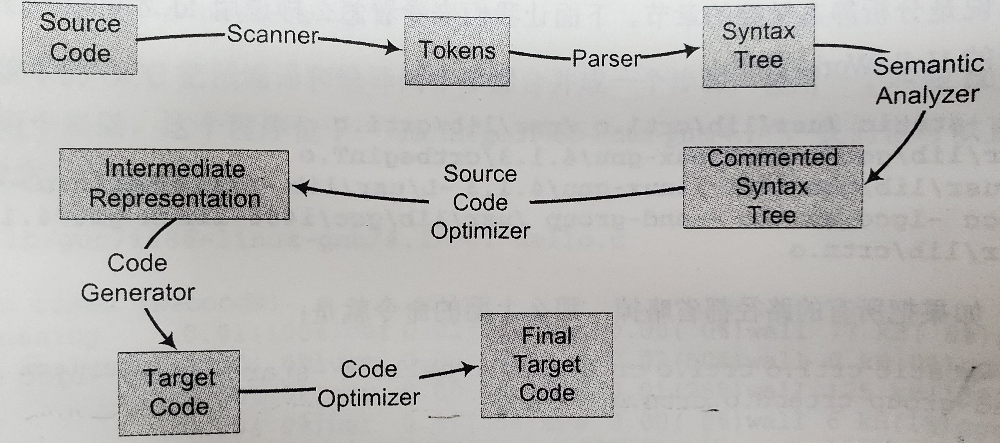
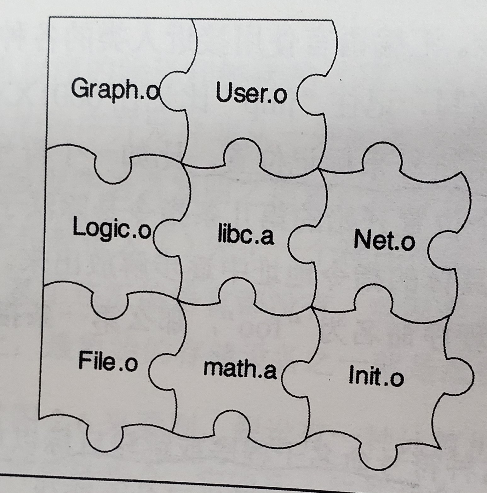
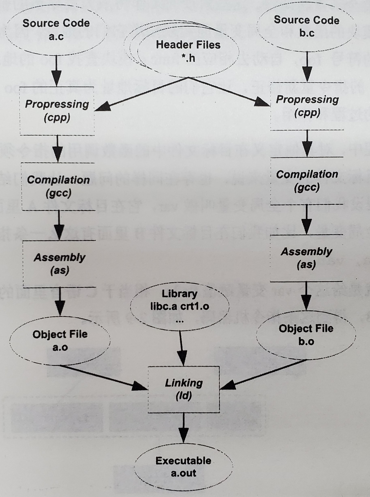
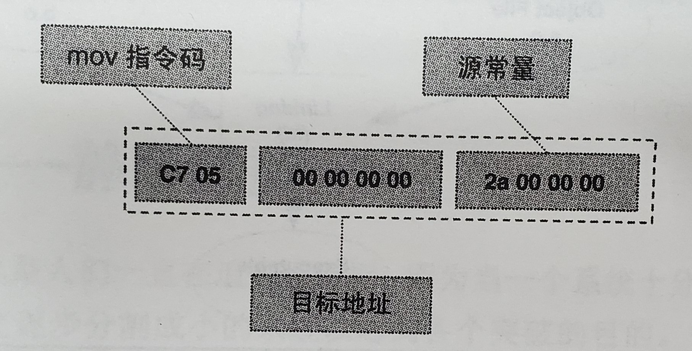

## 编译过程

<div>			<!--块级封装-->
    <center>	<!--将图片和文字居中-->
    
    <br>		<!--换行-->
            	<!--标题-->
    </center>
</div>

1. Prepressing    
   ```
    gcc -E hello.c -o hello.i (--verbose)
    或
    /usr/lib/gcc/x86_64-linux-gnu/10/cc1 -E hello.c > hello.i
    (cc1单独使用，会同时完成预编译和编译过程)
   ```
   预处理工作：
- 将所有#define删除，展开宏定义。
- 处理所有预编译指令，如#if,#ifdef,#elif,#else,#endif。
- 处理#include预编译指令，将文件插入到该位置，递归执行。
- 删除所有注释。
- 添加行号和文件名标志，以便编译时编译器产生调试用的行号信息及出错或警告时显示行号。    

2. Compilation
   ```
    gcc -S hello.c -o hello.s
    或
    /usr/lib/gcc/x86_64-linux-gnu/10/cc1 hello.c 
   ```
   实际上gcc只是各个工具的包装，如预编译编译程序cc1、汇编器as、链接器ld。根据不同参数和选项来调用不同的工具。   

3. Assembly
   ```
   as hello.s -o hello.o
   或
   gcc -c hello.s -o hello.o
   ```   

4. Linking
   汇编器输出的是一个目标文件，而不是一个可执行文件。后续还需要进行链接。
   用静态链接(省略路径)产生一个可执行程序的命令如下：    
   ```
   ld -static crt1.o crti.o crtbeginT.o hello.o -start-gruop -lgcc -lgcc_eh -ld-end-group crtend.o crtn.o
   ```   

## 编译器的工作
<div>			<!--块级封装-->
    <center>	<!--将图片和文字居中-->
    
    <br>		<!--换行-->
            	<!--标题-->
   扫描、语法分析、语义分析、源代码优化、代码生成、目标代码优化
    </center>
</div>

```
array[index] = (index + 4) * ( 2 + 6 )
```

1. 扫描
   源代码程序输入扫描器，扫描器将代码的字符序列分解为一系列Token，如关键字、标志符(array、index)、字面量、特殊符号。    
   同时将标志符放入符号表，将常量放到文字表等，以备后续步骤使用。
2. 语法分析
   对Token进行语法分析，产生语法树。完成对表达式语法层面的分析。
3. 语义分析
   分析语句是否合法有意义。如两个指针相乘，语法层面合法，但语义不合法。 


## 链接器的工作
对于跳转指令，如果使用绝对地址进行跳转，那么每次插入指令后都需要重新计算跳转地址，称为重定位Relocation。
>label（标签）用于代表地址，symbol（符号）用于代表常量。

---
由于代码量庞大，人们需要将代码组织分类，以便修改和复用，于是若干变量和函数组成模块，若干模块组成包。   

一个程序由若干个模块组合而成，对于静态语言，模块之间的通信有两种方式，一是模块间函数的调用，二是模块间变量的访问，都可与归结为模块间符号的引用。     
模块之间的拼接也就是链接。
>静态语言：在编译时，数据类型即可确定。

<div>			<!--块级封装-->
    <center>	<!--将图片和文字居中-->
    
    <br>		<!--换行-->
            	<!--标题-->
    </center>
</div>

### 模块拼接 --静态链接
链接主要内容即，把各个模块之间相互引用的部分处理好，使得各个模块能正确衔接。   
主要过程为：地址和空间分配、符号决议、重定位。    

<div>			<!--块级封装-->
    <center>	<!--将图片和文字居中-->
    
    <br>		<!--换行-->
            	<!--标题-->
    </center>
</div>

每个模块编译成.o目标文件，目标文件和库一起链接成可执行文件。 

---
使用举例   
在目标文件A中有全局变量var。   
在目标文件B中有指令：
`movl $0x2a, var`   
即给var赋值，编译后得到机器码：
<div>			<!--块级封装-->
    <center>	<!--将图片和文字居中-->
    
    <br>		<!--换行-->
            	<!--标题-->
    </center>
</div> 
在编译B时，编译器不知道var的地址，所以置为0,在链接时，由链接器修正地址，即重定位，每个要被修正的地方叫一个重定位入口Relocation Entry。